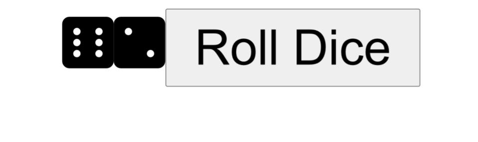

# **Dice Roller**

## Description
This was an exercise from the Udemy course, "The Modern React Bootcamp" by Colt Steele.  This exercise was for educational purposes and was used to practice React state, props, and simple click events.  Clicking the "Roll Dice" button will generate a number between 1 and 6 for the dice.

## Screenshot
